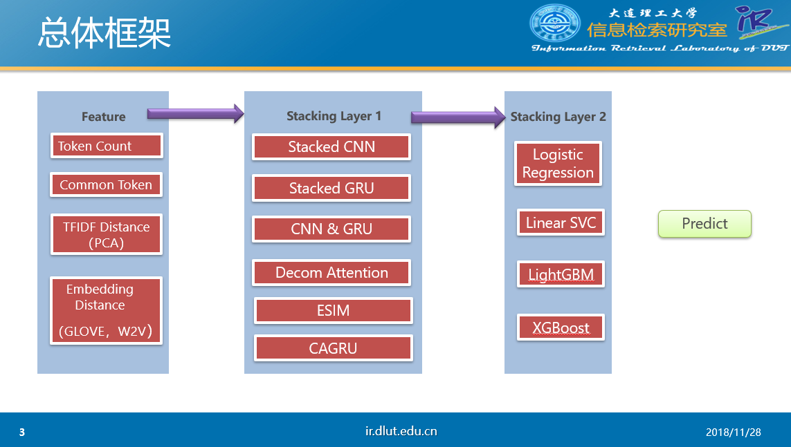

# TextSimilarityZoo

#### 项目介绍
文本匹配

#### 软件架构
```、
|-- data
    |-- train.csv    # 原始数据存放
|-- models  
    |-- *_char.py  # char level NN
    |-- *_word.py    # word level NN
    |-- *_features_char.py        # char level NN with features
    |-- *_features_word.py    # word level NN with features
    |-- layers.py     # customize layer  
    |-- carnn_layers.py      # customize layer
|-- feature
    |-- common_token.py  # 共现词特征
    |-- embedding_dis.py    # 词向量特征
    |-- expand_embedding_distance.py     # 用给的所有语料训练的w2v和glove词向量特征
    |-- fuzzy_wuzzy.py      # fuzzy_wuzzy
    |-- long_common_string.py  # 最长公共子串
    |-- powerful_token      # 显著词特征
    |-- token_count         # 统计特征
    |-- expand_vector.ipynb # 生成glove及w2v token向量
    |-- *.ipynb             # tfidf（raw和pca降维）的相似度特征
|-- cv_result
    |-- *.pkl          # 第一层stacking保存结果
|-- postprocess.py    # 第二层stacking及生成提交结果
|-- preprocess.py     # 原始数据处理
```

#### 实验环境
- python 3.6.4
- NVIDIA TitanXP
- requirements.txt


#### 使用说明
1. python preprocess.py    # 为NN模型预处理数据
2. python classifier/*.py  # 特征抽取
3. python models/*.py --gpu 1  # 模型训练
4. python post_processing.py   # 测试集结果文件生成

打包代码里没有保存的模型，可以直接运行1,2生成最好结果。


#### 学习模型
1. 第一层五折stacking模型（共26个）:
    - stacked cnn， stacked gru[1]， cnn_gru，cagru[4], decomposable[2],esim[3]。[]里的数字为下面的Reference
    - 上述每个模型*4 分别为word,char,word+features,char+features， 以及
    esim word+char, esim word+char+features
2. 第二层五折stacking模型（共4个）:
    - 输入为上一层stacking的26维结果。
    - LogisticRegression, LinearSVC, LightGBM
3. 对第二层输出的结果取平均输出结果

#### 特征工程
- 以下的token分别包含(char和word)
- common_token
    - 句子对共享token的数目，句子对token的jaccard系数，句子对共享token idf 加权得分，句子对共享token占原句的比例
- embedding_dis
    - 句子对token的wmd距离，句子对用向量表示后的各种距离
- expand_embeddings_distance
    - 将给定的数据分别利用gensim word2vec 和 Glove 训练的词向量，特征同上
- fuzzy_wuzzy
    - 句子对token的fuzzywuzzy
- long_common_string
    - 最长公共子串
- powerful_token
    - 重点区分词onehot 特征。
    - 比如某个token至少在20个句子对两边都出现，且为标签正确的比例>=0.9， 认为其为高度相关词
    - 比如某个token至少在20个句子对中的一侧出现，且为标签错误的比例>=0.9， 认为其为高度相关词
    - 。。。
-  token_count
    - 统计特征，句子token数目，句子去重token数，二者的比以及差值。
-  *.ipynb
    -  句子对tfidf和one hot 向量化的相似度计算交互特征
    -  句子对向量化利用PCA降维的相似度计算交互特征


#### Referenced
1. Shortcut-Stacked Sentence Encoders for Multi-Domain Inference  - EMNLP 2017 RepEval Multi-NLI Shared Task
2. A Decomposable Attention Model for Natural Language Inference  - EMNLP 2016
3. Enhanced LSTM for Natural Language Inference - ACL 2017
4. CIKM2018 rank2: https://github.com/zake7749/Closer
5. Kaggle Quora question pair rank4：https://github.com/HouJP/kaggle-quora-question-pairs


#### ResultAnalysis
- 整理代码中发现有一个模型esim_features_word_char保存时有bug，导致生成的train_new_x和test_new_x均为零向量
  但不影响最后的结果，相当于少了一个模型融合。
- 由于时间有限未进行详细的结果分析
    - 最好结果0.8879
    - debug后的 esim_features_word_char 五折直接average 0.8781
    - esim_features_char 五折直接average 0.8773
    - esim_features_char+esim_features_word+esim_word+esim_char 五折直接average 0.8832

#### PPT( to be continued)

-----